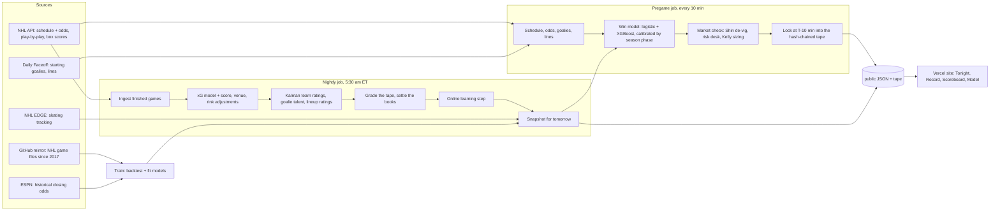

# Blue Line Capital

A machine-learning model that picks the winner of every NHL regular-season game (overtime and
shootouts included), locks each pick 10 minutes before puck drop in a tamper-evident ledger, and
grades itself against the betting market with five simulated bankrolls. Everything runs on its own:
GitHub Actions collects the data, trains, predicts and publishes; Vercel serves the site.

**Cost:** $0 per month (public GitHub repo + Vercel Hobby). A custom domain later is about $15 a year.

## Results so far: the walk-forward exam

Each season was replayed one day at a time by a model trained only on seasons at least two years
older, learning after every game exactly as it does live.

| Season | Games | Picks right | Log loss | Always-pick-home log loss |
|---|---|---|---|---|
| 2023-24 | 1,312 | 60.6% | 0.664 | 0.690 |
| 2024-25 | 1,312 | 57.6% | 0.668 | 0.687 |
| 2025-26 | 1,312 | 55.6% | 0.685 | 0.693 |
| **All** | **3,936** | **58.0%** | **0.672** | |

Log loss grades probabilities (lower is better; 0.693 is a coin flip). NHL closing betting lines
typically land around 0.67, so the model is roughly market-level. The Train workflow downloads
historical closing odds and adds the exact model-vs-market comparison to the site.

## How it works



The full explanation of every part, with the math and interview talking points, is in
[LEARN.md](LEARN.md).

## Setup (about 15 minutes)

1. **Create the repo.** On GitHub make a new **public** repository called `blue-line-capital`
   (public matters: Actions minutes are free and the site reads the data straight from the repo).
   Then from this folder:
   ```bash
   git init && git add . && git commit -m "Blue Line Capital"
   git branch -M main
   git remote add origin https://github.com/YOUR-USERNAME/blue-line-capital.git
   git push -u origin main
   ```
2. **Let Actions write.** Repo **Settings > Actions > General > Workflow permissions**: choose
   **Read and write permissions** and save.
3. **Point the site at your repo.** Edit `site/js/config.js`: set `owner` to your GitHub username.
   Commit and push.
4. **Run the Train workflow once.** **Actions > Train > Run workflow** (keep the odds box ticked).
   It takes about 20 to 40 minutes: it downloads historical closing odds, re-runs the backtest with
   the market comparison and retrains the model. The repo already ships a trained model, so the site
   works before this finishes.
5. **Deploy on Vercel.** **Add New > Project**, import the repo, set **Root Directory** to `site`,
   framework preset **Other**, no build command. Deploy. Data updates never trigger a redeploy
   (the site reads them from GitHub); only changes inside `site/` do.
6. **Watch the repo** (the eye icon on GitHub, "All activity") so data-source alerts reach your email.

After that, nothing needs you. Pregame runs every 10 minutes from 6 am to 2 am Eastern, nightly runs
at 5:30 am Eastern, and if a data source changes its format the pipeline opens a GitHub issue.

## Running it on your laptop

```bash
pip install -r requirements.txt
python -m tests.test_live_flow            # fake opening night, end to end (writes to a temp folder)
python -m pipeline.run pregame            # today's slate (needs internet)
python -m http.server 8000                # then open http://localhost:8000/site/
```

| Command | What it does |
|---|---|
| `python -m pipeline.run train [--odds] [--skip-backtest]` | Full rebuild: history, backtest, live model, snapshot |
| `python -m pipeline.run nightly` | Ingest last night, grade, settle, learn, snapshot |
| `python -m pipeline.run pregame [--date YYYY-MM-DD]` | Predict, lock, publish |
| `python -m pipeline.run backtest` | Just the three-season exam |
| `python -m pipeline.run doctor` | Check every data source |

## What's where

```
pipeline/          the model and the jobs (Python)
  config.py        every setting in one place
  parse_game.py    raw NHL game JSON -> shots, events, players
  xg_model.py      expected goals
  team_stats.py    score/venue and rink adjustments
  ratings.py       Kalman filter power ratings
  goalies.py       goalie talent + streak test
  players.py       Game Score lineup ratings
  features.py      the 25 model inputs
  win_model.py     logistic regression + XGBoost, calibration, online learning
  backtest.py      walk-forward exam (+ market comparison)
  market.py        odds, Shin de-vig, risk desk, Kelly, books
  tape.py          hash-chained ledger
  live.py          tonight's predictions
  run.py           command line (what GitHub Actions calls)
  publish.py       writes public/*.json for the site
site/              the website (static HTML/CSS/JS, GSAP, self-hosted fonts)
data/tables/       every game since 2017-18 as parquet tables
state/             trained models, snapshot, record
tape/              locked predictions, one line each
public/            what the site reads
tests/             end-to-end test of the live loop
```

The bankroll is simulated and nothing here is betting advice.
